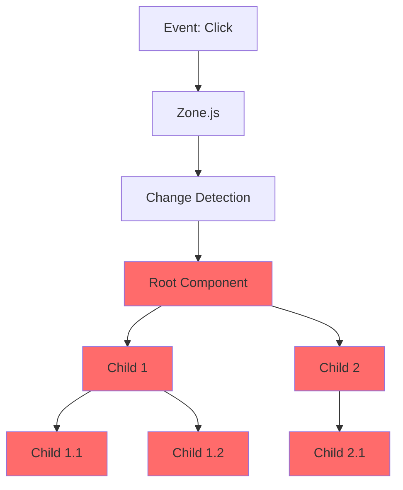

# Angular Zoneless

## Der Paradigmenwechsel zu Reactive Programming

### Von Implicit Change Detection zu Signals & Async Resources

---
layout: center
---

# Warum ist das relevant?

<v-clicks>

- 🔄 **Fundamentaler Richtungswechsel** in Angular (v16+)
- ⚡ **Performance-Revolution** durch gezieltes Update-System
- 🧠 **Neue Denkweise** erforderlich
- 📦 Möglicherweise **unbemerkt** an vielen vorbei gegangen

</v-clicks>

---

# Früher vs. Heute

<div class="grid grid-cols-2 gap-8">

<div>

## 🎩 Die alte Magie

```typescript
// Angular zaubert automatisch
@Component({...})
class OldComponent {
    counter = 0;

    increment() {
        this.counter++;
        // Angular merkt's automatisch! ✨
    }
}
```

**"Ich ändere etwas und Angular kümmert sich darum"**

</div>

<div v-click>

## 🎯 Die neue Explizitheit

```typescript
// Ich kommuniziere Änderungen
@Component({...})
class NewComponent {
  counter = signal(0);
  
  increment() {
    this.counter.update(v => v + 1);
    // Ich sage Angular explizit: Update!
  }
}
```

**"Ich kommuniziere Änderungen und Angular aktualisiert gezielt"**

</div>

</div>

---
layout: center
class: text-center
---

# Teil 1

## Die alte Welt: Zone.js & Implicit Change Detection

---

# Was ist Zone.js?

<v-clicks>

- 📝 **Monkey-Patches** alle async APIs (setTimeout, events, HTTP, ...)
- 👀 **Überwacht** automatisch alle Async-Operationen
- 🔔 **Benachrichtigt** Angular über potenzielle Änderungen
- 🔄 **Triggert** Change Detection für die gesamte Component-Tree

</v-clicks>

<v-click>

```typescript
// Zone.js wrapped event listener
button.addEventListener('click', () => {
  this.data = 'Neu';  
  // Zone.js merkt: "Event handler fertig!"
  // → Führt Change Detection aus
});
```

</v-click>

---

# Klassisches Angular Component

```typescript {all|3-8|10-12|14-20|all}
@Component({
  selector: 'app-user-list',
  template: `
    <h2>Benutzer: {{ users.length }}</h2>
    <ul>
      @for (user of users; track user.id) {
        <li>{{ user.name }}</li>
      }
    </ul>
    <button (click)="loadUsers()">Laden</button>
  `
})
export class UserListComponent implements OnInit {
  users: User[] = [];
  
  ngOnInit() {
    this.loadUsers();
  }
  
  loadUsers() {
    this.http.get<User[]>('/api/users').subscribe(data => {
      this.users = data;
      // Zone.js triggert automatisch Change Detection! ✨
    });
  }
}
```

---

# Was passiert unter der Haube?

<div class="grid grid-cols-2 gap-8 text-sm">

<div>

### Jeder Click/Request/Timeout

1. Zone.js fängt Event ab
2. Führt Callback aus
3. Markiert Component als "dirty"
4. **Prüft GESAMTEN Tree**
5. Vergleicht alte vs. neue Werte
6. Aktualisiert DOM

</div>

<div v-click>

### Das Problem



**Alle Components werden geprüft!**

</div>

</div>

---
layout: center
class: text-center
---

# Der Paradigmenwechsel

## Warum ändert Angular die Strategie?

---

# Probleme der alten Lösung

<v-clicks>

## 🐌 Performance

- Change Detection läuft durch **gesamten** Component Tree
- Viele unnötige Checks bei großen Anwendungen
- Bundle-Size: Zone.js fügt ~15-20KB hinzu

## 🎭 "Magic" = Unvorhersehbar

- Schwer zu debuggen: "Warum wird das nicht aktualisiert?"
- Oder: "Warum wird das zu oft aktualisiert?"
- Keine Kontrolle über Update-Timing

## 🔮 Zukunftsfähigkeit

- Moderne Frameworks (React, Vue 3, Solid) setzen auf Signals
- Fine-grained Reactivity ist der neue Standard

</v-clicks>

---

# Die Vision

<div class="grid grid-cols-2 gap-12">

<div>

## Implicit (alt)

```
"Framework, mach du mal!"
```

- ❌ Keine Kontrolle
- ❌ Performance-Overhead
- ✅ Einfach für Anfänger
- ✅ Weniger Code

</div>

<div>

## Explicit (neu)

```
"Ich sage dir genau, was sich ändert"
```

- ✅ Volle Kontrolle
- ✅ Optimale Performance
- ✅ Vorhersagbar
- ⚠️ Steile Lernkurve

</div>

</div>

---
layout: center
class: text-center
---

# Teil 2

## Die neue Welt: Signals & Zoneless

---

# Signals: Die Grundbausteine

```typescript {all|2|4|6|8-10|all}
// Signal erstellen
const count = signal(0);

console.log(count());  // 0 - Lesen mit ()

count.set(5);          // Setzen

count.update(value => value + 1);  // Update basierend auf aktuellem Wert

console.log(count());  // 6
```

<v-clicks>

- 📦 **Wrapper** um einen reaktiven Wert
- 📖 Lesen mit `()`
- ✍️ Schreiben mit `.set()` oder `.update()`
- 🔔 Angular weiß **genau**, was sich geändert hat

</v-clicks>

---

# Computed Signals

```typescript {all|2-3|5-9|11-12|all}
@Component({...})
class ShoppingCart {
  items = signal<Item[]>([]);
  
  // Wird automatisch neu berechnet wenn items sich ändert
  totalPrice = computed(() => {
    return this.items()
      .reduce((sum, item) => sum + item.price, 0);
  });
  
  addItem(item: Item) {
    this.items.update(current => [...current, item]);
    // totalPrice wird automatisch aktualisiert! 🎯
  }
}
```

<v-click>

**Computed Signals** = Abgeleitete Werte, die sich automatisch aktualisieren

</v-click>

---

# Effects: Seiteneffekte

```typescript {all|4-8|all}
@Component({...})
class UserProfile {
  userId = signal(123);
  
  constructor() {
    effect(() => {
      console.log('User changed:', this.userId());
      this.trackAnalytics(this.userId());
    });
  }
  
  changeUser(newId: number) {
    this.userId.set(newId);
    // Effect wird automatisch ausgeführt! 📡
  }
}
```

<v-click>

**Effects** = Code der läuft, wenn sich Signals ändern (ähnlich wie useEffect in React)

</v-click>

---

# Async Resources (rxResource)

```typescript {all|3-7|9-12|14-17|all}
@Component({
  template: `
    @if (users.isLoading()) {
      <p>Lädt...</p>
    } @else if (users.hasError()) {
      <p>Fehler: {{ users.error() }}</p>
    } @else {
      <ul>
        @for (user of users.value(); track user.id) {
          <li>{{ user.name }}</li>
        }
      </ul>
    }
  `
})
class UserList {
  http = inject(HttpClient);
  
  users = rxResource({
    loader: () => this.http.get<User[]>('/api/users')
  });
}
```

---

# Zoneless aktivieren

```typescript {all|5-8|all}
// main.ts
import { bootstrapApplication } from '@angular/platform-browser';
import { provideZonelessChangeDetection } from '@angular/core';

bootstrapApplication(AppComponent, {
  providers: [
    provideZonelessChangeDetection()
  ]
});
```

<v-clicks>

- 🎯 Seit Angular 18 experimentell verfügbar
- ✅ **Stable seit Angular 19** (November 2024)
- 📦 Zone.js wird nicht mehr geladen
- ⚡ Nur Signals, Async Pipe & explizite `markForCheck()` triggern Updates

</v-clicks>

---
layout: center
class: text-center
---

# Vergleich

## Vorteile & Nachteile beider Ansätze

---

---

# Zone.js Approach

<div class="grid grid-cols-2 gap-12 mt-8">

<div>

## ✅ Vorteile

- Einfach für Einsteiger
- Weniger Boilerplate
- "Es funktioniert einfach"
- Bewährte Lösung (seit Angular 2)

</div>

<div>

## ❌ Nachteile

- Performance-Overhead
- Unvorhersagbares Verhalten
- Schwer zu debuggen
- Größere Bundle-Size
- Prüft gesamten Tree

</div>

</div>

---

# Signals & Zoneless

<div class="grid grid-cols-2 gap-12 mt-8">

<div>

## ✅ Vorteile

- 🚀 Deutlich bessere Performance
- 🎯 Präzise Updates (fine-grained)
- 📉 Kleinere Bundle-Size
- 🔮 Vorhersagbar & debuggbar
- 🌍 Aligned mit modernen Standards

</div>

<div>

## ❌ Nachteile

- Steile Lernkurve
- Mehr Code zu schreiben
- Migration bestehender Apps aufwändig
- Breaking Change für viele Patterns

</div>

</div>

---

# Migration Considerations

<v-clicks>

## Wann macht der Wechsel Sinn?

✅ **Neue Projekte**: Auf jeden Fall Signals nutzen!

✅ **Performance-kritische Apps**: Große Anwendungen profitieren enorm

⚠️ **Bestehende Apps**: Schrittweise Migration möglich
- Beide Ansätze können koexistieren
- Neue Components mit Signals schreiben
- Alte Components nach und nach migrieren

❌ **Kleine, einfache Apps**: Migration-Aufwand eventuell nicht gerechtfertigt

</v-clicks>

---

# Migration Path

```typescript
// Phase 1: Beide Ansätze parallel
@Component({...})
class MixedComponent {
  // Alt: normale Properties
  oldCounter = 0;
  
  // Neu: Signals
  newCounter = signal(0);
  
  // Funktioniert beides!
}
```

<v-click>

```typescript
// Phase 2: Vollständig auf Signals
@Component({...})
class FullyModernComponent {
  counter = signal(0);
  users = signal<User[]>([]);
  filteredUsers = computed(() => 
    this.users().filter(u => u.active)
  );
}
```

</v-click>

<v-click>

💡 **Tipp:** Apps mit `OnPush` Change Detection Strategy migrieren leichter zu Zoneless - das kann ein guter Zwischenschritt sein!

</v-click>

---
layout: center
class: text-center
---

# Ausblick & Fazit

---

# Angular's Roadmap

<v-clicks>

- ✅ **Angular 19** (November 2024): Signals & Zoneless sind **stable**
- ✅ **Angular 20** (Mai 2025): Weitere Optimierungen und Performance-Verbesserungen
- 🎉 **Angular 21** (November 2025, gerade erschienen!):
    - **Signal Forms** als neuer Standard
    - **Zoneless ist jetzt der Default**
    - Zone.js nur noch opt-in für Legacy-Apps
- 🔄 Immer mehr APIs werden Signal-basiert (Router, HttpClient, etc.)
- 🌟 Angular ist vollständig auf **Fine-grained Reactivity** umgestellt

**Signals sind nicht mehr die Zukunft - sie sind die Gegenwart!**

</v-clicks>

---

# Empfehlungen für Teams

<v-clicks>

## 🚀 Neue Projekte
Nutzt Signals von Anfang an. Es lohnt sich!

## 🔄 Bestehende Projekte
- Evaluiert den Performance-Impact
- Plant schrittweise Migration
- Schult das Team in Signals

## 📚 Learning
- Offizielle Angular Docs
- Experimentiert mit Signals
- Best Practices entwickeln sich noch

</v-clicks>

---
layout: center
class: text-center
---

# Fazit

<v-clicks>

## Angular vollzieht einen mutigen Paradigmenwechsel

Von **"Magic"** zu **"Explizit"**

Von **"Implicit"** zu **"Reactive"**

Von **"Overhead"** zu **"Performance"**

</v-clicks>

---
layout: end
class: text-center
---

# Danke!

## Fragen?

<div class="pt-12 text-sm opacity-50">
Slides erstellt mit Slidev
</div>
